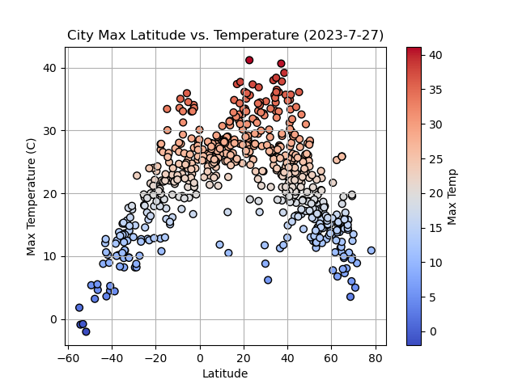

## Module 6 Challenge, 27 July 2023, API Challenge (World Weather Analysis)

Development on this project has stopped.

## Description

The Jupyter Notebook WeatherPy pulls weather data for a random sample of cities worldwide, located by using a random sample of latitude and longitude numbers, and investigates the relationship between latitude and a number of weather variables. 

VacationPy uses this information to limit the random cities to a sample of possible vacation destinations, hardcoded to my admittedly whimsical desires (Max Temp above 25 celsius, humidity above 50%, and cloudiness below 30%), and tries to locate the closest hotel within 10km of each possible vacation spot.

A written analysis of the relationship between linear regression and the results is included in the last section of WeatherPy, covering the northern and southern hemisphere, and the relationship between latitude and four variables: max temperature, humidity, cloudiness, and wind speed. Unsurprisingly, only the max temperature is related to latitude.

## Usage

You can view the recent results in WeatherPy.ipynb and VacationPy.ipynb, located in the repository root. If you want to run the code, restart the kernel and 'run all'.

## Gallery of Significant Results:

Global City Latitude vs Max Temperature:

Northern Hemisphere Latitude vs Max Temperature with Linear Regression:

Southern Hemisphere Latitude vs Max Temperature with Linear Regression:

## Acknowledgments

Thanks to Geronimo Perez for feedback and assistance

## Author

Bryan Johns, July, 2023
